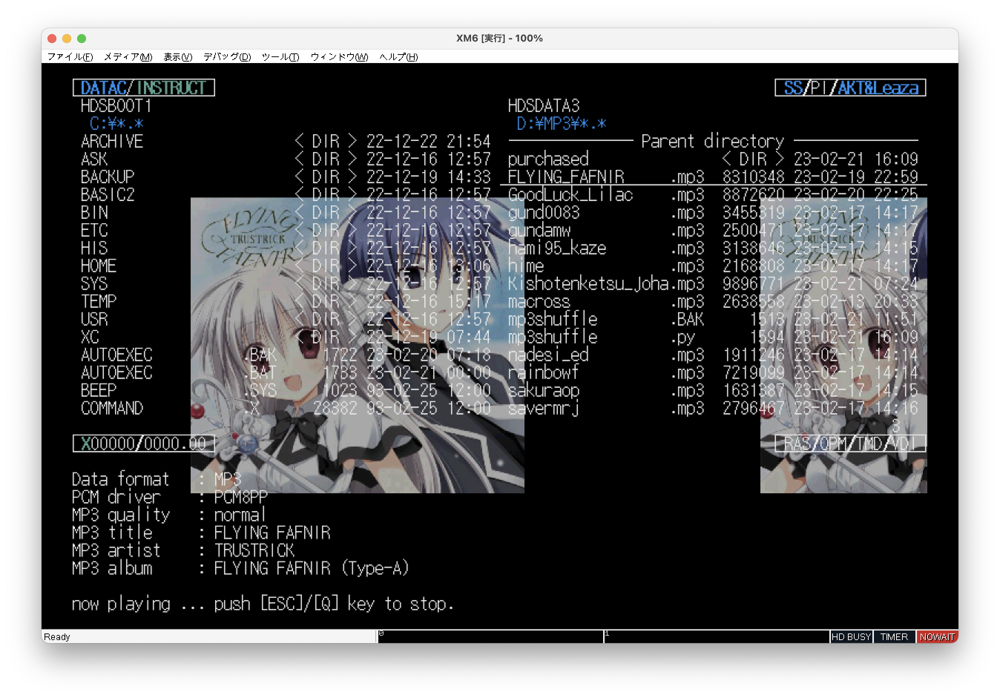
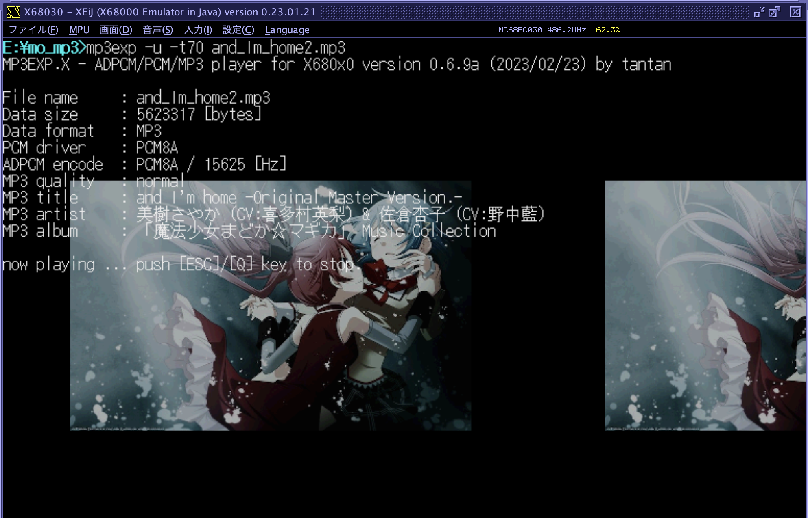
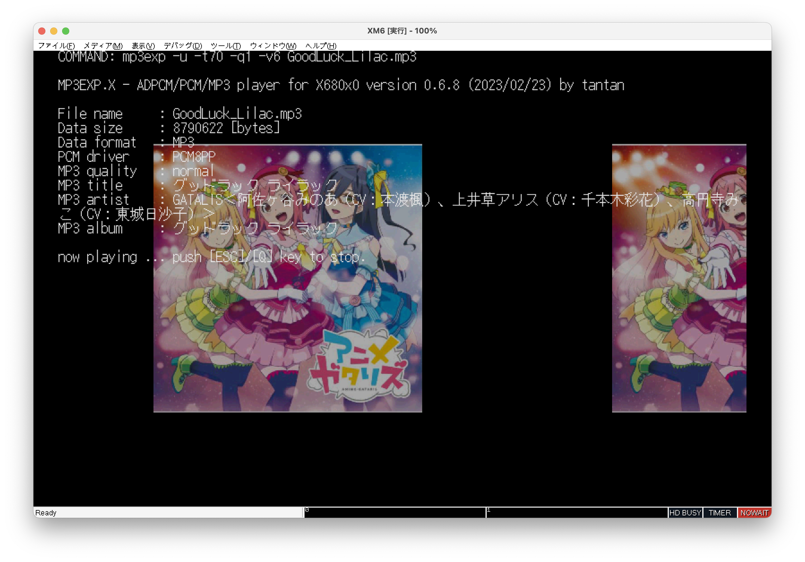
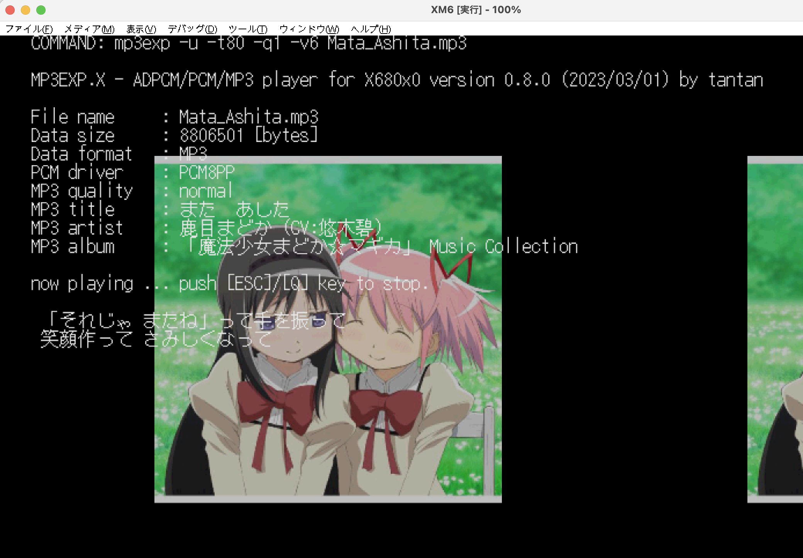
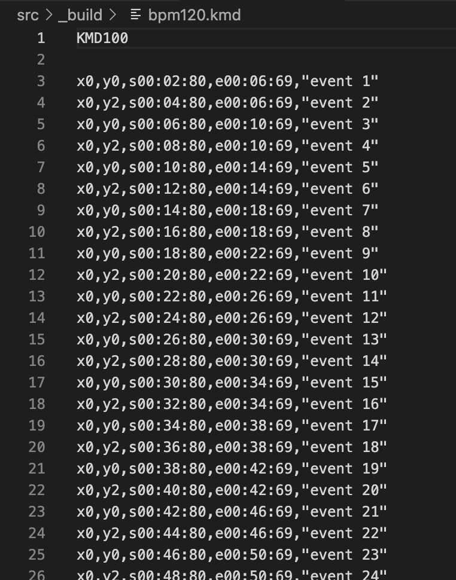

# MP3EXP.X
ADPCM/PCM/WAV/MP3 player for X680x0/Human68k

以下の形式のファイルを再生するプレーヤーです。ファイルの種別は拡張子で判断します。

 - X68k(MSM6258V) ADPCM 15.6kHz mono (.PCM)
 - 16bit符号付き big endian raw PCM (.S32/.S44/.S48/.M32/.M44/.M48)
 - 16bit符号付き WAV (.WAV)
 - 4bit符号付き YM2608 ADPCM (.A32/.A44/.A48/.N32/.N44/.N48)
 - 固定/可変ビットレート MP3 (.MP3)

MP3のアルバムアート表示(JPEG/PNG)に対応しています。

KMD歌詞ファイルの簡易表示に対応しています。

出力デバイスはX68k内蔵ADPCMまたはMercury-Unit(V3.5以上)になります。組み込むPCM8ドライバによって決まります。

- PCM8A.X(出力先は内蔵ADPCM) ... すべての形式がリアルタイムに内蔵ADPCMの音声に変換されて出力されます。
- PCM8PP.X(出力先はMercury-Unit) ... 内蔵ADPCM形式も含めたすべての形式の音声がMercury-Unitから出力されます。

注意：MP3ファイルの再生はかなりのMPUパワーを必要とします。事実上エミュレータ向けのオマケですが、後述するキャッシュ機能を使えば実機でも何とかなります。

注意：このプログラムはコンバータではありません。MP3形式ファイルを ADPCM/PCM 形式に変換するには

[MP3EX.X](https://github.com/tantanGH/mp3ex)

の方を使ってください。

---

### Install

MPEXPxxx.ZIP をダウンロードして展開し、MP3EXP.X をパスの通ったディレクトリに置きます。

デフォルトではADPCMのエンコードに philly さんの PCM8A.X 1.02 を使用します(オリジナルのPCM8.Xではありません)。

[PCM8A.X](http://retropc.net/x68000/software/sound/adpcm/pcm8a/)

注意：PCM8Aの拡張APIを使用しているため、PCM8Aは必ず1.02以上を導入してください。X68000 LIBRARY からダウンロードできます。

Mercury-Unit で再生する場合には たにぃ さんの PCM8PP.X 0.83d を使用します。
導入していないかバージョンが古い場合は X68000 LIBRARY からダウンロードして導入してください。

[PCM8PP.X](http://retropc.net/x68000/software/hardware/mercury/pcm8pp/)

注意：PCM8PPはデフォルトで再生周波数44.1kHzとなります。S48/M48などの48kHzのPCMデータを再生するためにはPCM8PPのコマンドラインオプションで48kHzの再生周波数を指定する必要があります。

注意：MP3再生時はデフォルトで周波数ハーフモードを使用するため Mercury-Unit V3.5 以上が必要です。オプション(`-q0`)でフル周波数再生も可能です。その場合は V3.0/V3.1 でも大丈夫かもしれません。

注意：満開版 V4.0 での動作確認はしていません。(当方のエミュレータ環境だと V4.0 では pcm8pp.x が組み込めませんでした)

---

### 推奨環境

以下のエミュレータ環境を推奨します。

XM6 typeG
 - X68030 68EC030 25MHz メモリ12MB MPU高速化許可 TS-6BE16拡張メモリ有効 ま〜きゅり〜ゆにっとV3.5
 - ハイメモリドライバ [TS16DRVp.X](https://t.co/qJDbBEiJsS) [https://twitter.com/arith_rose/status/1612786081308774402](https://twitter.com/arith_rose/status/1612786081308774402)
 - PCM8PP.X -c1 -s4 (48kHzデータ再生時は -c1 -s2)
 - MP3再生時にはMPUノーウェイト設定

実行例

    mp3exp -u -q1 -t75 hogehoge.mp3

ホスト機に余裕があるならば -q1 ではなく -q0 かつ PCM8PP.X -c1 -s2 で。

---

### エミュレータ XEiJ での利用上の注意

XEiJ は Java VM上で実行できる X68k エミュレータで、macOSでも安定して使えるため当方が最も愛用しているものになります。

ただし、MP3EXP.X を XEiJ 上で利用する際には以下の制限があります。

- HDSイメージをマウントしたドライブ上でのADPCM/PCMファイルの逐次再生不可 (音が途切れる)

これは2023.2現在のXEiJのDMAC実装では、HD転送(DMAC ch1)とADPCM転送(DMAC ch3)が同時に発生した際、チャンネル間のプライオリティ設定が考慮されないのと、HD転送(DMAC ch1)が使うオートリクエスト最大速度モードの時はMPUの動作が完全停止する実装となっているためです。

このため、XEiJでMP3EXPを利用する場合は、DMA転送を使わないRAMDISKまたはHFS(ホストファイルシステム)を使うか、最初に丸ごと全部読み込んでしまうMP3再生に留めるかにしてください。

なお、この制限は他の動画再生系・音声再生系ソフトでも同様です(mmvp.xなど)。

---

### データ形式ごとの要求MPU能力

* ADPCMファイルの再生

ディスク読み込みが遅くなければ X68000 10~16MHz機でも大丈夫かもしれません。ADPCMファイルは逐次ディスクから読み取ります。

* PCMファイルの再生

S44 (44.1kHz 16bit PCM stereo) の再生には最低 X68000 24MHz が必要です。実機ではX68030以上を推奨します。PCMファイルは逐次ディスクから読み取ります。

* WAVファイルの再生

S44と同等ですが、エンディアン変換が入るのでほんの少しだけ上のパワーが必要です。

* YM2608 ADPCMファイルの再生

A44 (44.1kHz 16bit PCM stereo software ADPCM) の再生は S44と同等かやや上のパワーが必要です。ディスク読み込み負担が減る代わりにデコードの負担で相殺されます。

* MP3ファイル

XEiJエミュレータでの検証では X68000-600MHz, X68030-500MHz, 060turbo-50MHz が必要です。
XM6gエミュレータでの検証では MPUノーウェイト オプションを有効にすることで X68000/X68030 いずれも再生可能でした。
ただしMP3ファイルは最初に丸ごとメモリに読み込みます。12MBメモリフル実装設定かつハイメモリの利用を強くお勧めします。
また、後述するキャッシュ機能を併用すると良いかもしれません。

---

### MP3キャッシュ

MP3のデコード処理はとても重いため、実機での再生はなかなか困難です。060turbo＋ハイメモリでもバッファを多めに取らないと厳しい感じです。

そこで、MP3と同じフォルダに同じ主ファイル名で S44/WAV/A44 のいずれかのファイルを置くと、MP3はタグ情報とアルバムアートの参照だけに使われ、音の再生については S44/WAV/A44 が自動的に使われます。

MP3 -> S44/A44 については コンバータ[MP3EX.X](https://github.com/tantanGH/mp3ex) を使うことで変換できます。

どうしても実機で再生したい、エミュレータのMPUノーウェイトは抵抗がある、という方は検討ください。

---

### コマンドラインオプション

引数をつけずに実行するか、`-h` オプションをつけて実行するとヘルプメッセージが表示されます。

    usage: mp3exp [options] <input-file[.pcm|.sXX|.mXX|.aXX|.nXX|.wav|.mp3]>
    options:
         -v[n] ... volume (1-15, default:7)
         -l[n] ... loop count (none:infinite, default:1)
         -q[n] ... mp3 quality (0:high, 1:normal, 2:low, default:1)
         -t[n] ... mp3 album art brightness (1-100, 0:off, default:0)
         -x    ... mp3 album art half size

         -b<n> ... buffer size [x 64KB] (2-96,default:4)
         -u    ... use 060turbo/TS-6BE16 high memory for buffering

         -z    ... use little endian for .s44/.m44
         -h    ... show help message

`-v` オプションでPCM8A.X/PCM8PP.X使用時の音量を指定します。デフォルトは7です。PCM8A/PCM8PP標準は8ですが、音割れを防ぐために7としています。

`-l` オプションでループ回数を指定します。数字を省略した場合は無限ループになります。

`-q` オプションでMP3再生時の品質を指定します。0でオリジナルのサンプリング周波数、1でオリジナルのサンプリング周波数の半分、2でオリジナルの1/4でデコードします。デフォルト(オプションなし)は1です。2のlow qualityモードの場合、内蔵ADPCMの再生周波数は10.4kHzモードになります。

`-t` オプションでMP3アルバムアート表示の明るさを指定します。オプションなしまたは0の場合は表示しません。アルバムアートはjpeg/pngのみ対応しています。デフォルトでは1/2サイズに縮小されて表示されます。

`-x` オプションで拡大表示モード。KMD歌詞データを24ドットフォントで表示します。また、MP3アルバムアートをオリジナルの大きさで表示します。512x512を超える部分はカットされます。この時にファンクションキー表示行も消します。

`-b` オプションでリンクアレイチェーンのバッファ数を指定します。1バッファが約64KBです。デフォルトは4です。再生が追いつかずにバッファアンダーランのエラーで途中終了してしまうような場合は大きくしてみてください。

`-u` オプションで可能な限り060turbo/TS-6BE16のハイメモリからアロケートします。060turbo.sys/HIMEM.SYS/TS16DRVp.Xなどのハイメモリドライバの事前導入が必要です。ただしDMACの転送が必要な部分についてはオプションの指定によらずメインメモリからアロケートします。MP3EXP.X は 060loadhigh によりプログラム部分のハイメモリ実行に対応していますが、060high でアロケート領域もハイメモリから取る実行はしないでください。

`-z` .s44/.m44等の16bitPCMデータを強制的にlittle endianと見なします。本来.s44/.m44はbig endianが仕様ですので、なるべくこのオプションではなく元データをコンバートすることをお勧めします。

---

### Shuffle play

ソースツリーの `python/` フォルダの中にある `mp3shuffle.py` は [MicroPython for X680x0](https://github.com/yunkya2/micropython-x68k) 上で動作するシャッフル再生ツールです。カレントディレクトリにあるMP3ファイルをランダムに選択して再生します。コマンドライン引数で何ループするかを指定できます。

---

### KMD歌詞ファイル再生

Mercury-Unit デファクトスタンダードの録音再生ツール、Yas氏のSMR.XのKMD歌詞データファイルの簡易表示に対応しています。オリジナルのように24x24フォントではなく、通常の16x16フォント2段で表示します。PCM/S44/A44だけでなくMP3でも利用できます。

表示上の差異がありますので、KMDデータを新規に作成する際には必ずSMR.Xで表示を確認するようにしてください。

---

### KMD歌詞ファイルテンプレート作成ツール

ソースツリーの `python/` フォルダの中にある `kmdgen.py` は [MicroPython for X680x0](https://github.com/yunkya2/micropython-x68k) を含めたPython環境上で動作するKMDファイルテンプレート(タイムテーブル)自動作成ツールです。以下のように7つのコマンドラインパラメータを渡して利用します。

    micropython kmdgen.py <total-seconds> <bpm> <beat-interval> <beat-skip> <event-offset> <erase-offset> <out-file>

または

    python3 kmdgen.py <total-seconds> <bpm> <beat-interval> <beat-skip> <event-offset> <erase-offset> <out-file>

などとして実行します。

Pythonなしで Human68k 上で直接実行できる.X形式の [KMDGEN.X](https://github.com/tantanGH/kmdgen)も用意しています。

`total-seconds` ... 曲のトータル時間を秒単位で指定します。

`bpm` ... 対象となる曲のBPM(1分間に何拍打つか)を指定します。BPMを知るには、

- [BPMCHK.X](https://github.com/tantanGH/bpmchk) や [aubio](https://aubio.org/)などのツールを使って調べる
- メトロノームアプリやYoutubeのBPM動画などを合わせて再生して自分で調べる
- スマホアプリやWebの無料サービスなどを使って調べる。 

などの方法があります。自分は macOSで aubio を使っています。
BPMCHK.X は aubio ライブラリをS44対応改造し、x68k向けにコンパイルしてBPM算出に特化したツールです。

いくつかテンプレートをBPMをずらして作ってみて再生し、しっくりくるものをベースに編集に入るのも良いと思います。
出力されたテンプレートはダミーメッセージが入っていますがそのまますぐに SMR.X / MP3EXP.X で再生可能です。

`beat-interval` ... 何拍ごとにKMDのイベント行を出力するかの指定。イベントは y0 → y2 → y0 → y2 → ... のように、y位置が交互に繰り返す形で出力されます。y1 の出力はされません。

`beat-skip` ... 歌詞表示イベント行の出力を曲の出だしの何拍分スキップするかの指定。イントロ部分を飛ばしたいときなど。

`event-offset` ... 歌詞表示は通常拍ぴったりではなく、やや前にすることが多いです。拍の何tick前にstを設定するかのオフセット指定です。1tickは10msec(KMDの最小時間単位)です。

`erase-offset` ... 歌詞表示を消すタイミング(et)は、次のy0イベントのstの1tick前がデフォルトになります。このオフセットを指定するとさらにそれよりも指定したtick分だけ前にetを設定します。

`out-file` ... 出力先のKMDファイル名です。既にファイルが存在する場合は上書きするかの確認を求められます。

実行例：

    micropython kmdgen.py 180 120 4 6 20 10 bpm120.kmd

180秒・120BPMの曲に対して4拍ごとにイベント行を出力。最初の6拍についてはスキップしイベントの出力は行わない。イベントはそれぞれの拍の20ticks(200msec)前を開始時間(st)とする。各イベントの消去時刻(et)は次のy0イベントの 10+1=11ticks(110msec)前とする。結果はbpm120.kmdに書き出す。

---

### License

MP3デコードライブラリとして libmad 0.15.1b をx68k向けにコンパイルしたものを利用させて頂いています。libmad は GPLv2 ライセンスです。

JPEGデコードライブラリとして Martin J. Fiedler氏の nanojpeg を改造したものを利用させて頂いています。nanojpeg は MIT ライセンスです。

PNGデコードのために zlib をx68k向けにコンパイルしたものを利用させて頂いています。zlibのライセンスはzlibライセンスです。

YM2608 ADPCM形式のデコードライブラリとして Otankonas氏のライブラリコードの一部を当方でデバッグしたものを利用させて頂いています。

以上により MP3EXP のライセンスは libmad に準じた GPLv2 です。

---

### Special Thanks

* xdev68k thanks to ファミべのよっしんさん
* HAS060.X on run68mac thanks to YuNKさん / M.Kamadaさん / GOROmanさん
* HLK301.X on run68mac thanks to SALTさん / GOROmanさん
* XEiJ & 060turbo.sys thanks to M.Kamadaさん
* XM6 TypeG thanks to PI.さん / GIMONSさん
* PCM8A.X thanks to phillyさん
* PCM8PP.X thanks to たにぃさん
* TS16DRVp.X thanks to M.Kamadaさん / はうさん / みゆ🌹ฅ^•ω•^ฅ さん
* MicroPython.X thanks to YuNKさん / daaさん
* ADPCMLIB thanks to Otankonas さん
* KMDデータ資料およびサンプルデータ提供 デバッグ協力 thanks to かきうちさん / X68PRO さん

---

### History

* 0.8.7 (2023/03/05) ... -x指定時はKMDを24ドットフォントで表示するようにし、MP3アルバムアートは等倍表示かつファンクションキー表示を消すようにした WAVEフォーマット対応改善
* 0.8.6 (2023/03/04) ... スペースキーで一時停止できるようにした
* 0.8.5 (2023/03/04) ... WAVEファイル再生に対応 リトルエンディアンPCM再生に対応 KMD表示改善 コマンドラインオプション整理
* 0.8.1 (2023/03/01) ... KMD表示改善
* 0.8.0 (2023/03/01) ... KMD歌詞ファイルの簡易表示に対応
* 0.7.7 (2023/02/28) ... N44をステレオと解釈してしまっていたのを修正
* 0.7.6 (2023/02/26) ... 特にA44の再生時に音割れする場合があったのでPCM8A/PCM8PPのデフォルトの音量を7にした
* 0.7.5 (2023/02/24) ... YM2608 ADPCM形式に正式対応した(.A44/.N44)
* 0.7.2 (2023/02/24) ... MP3 low quality mode (-q2) をサポートした 速度優先でコンパイルしたlibmadをリンクした
* 0.7.0 (2023/02/23) ... MP3ファイルと同じフォルダにS44/A44ファイルが存在した場合、再生時にそれを参照するようにした
* 0.6.9 (2023/02/23) ... 68000MPUでMP3再生時にアドレスエラーが出ていたのを修正 -b32より大きいとバスエラーが出ていたのを修正
* 0.6.8 (2023/02/23) ... YM2608 ADPCM(.a44)の再生に対応した
* 0.6.5 (2023/02/22) ... アルバムアートのハーフサイズをデフォルトにした
* 0.6.4 (2023/02/22) ... -u指定時にハイメモリドライバの登録チェックをするようにした
* 0.6.3 (2023/02/22) ... -bオプションの最大値を32から128にした
* 0.6.2 (2023/02/22) ... アルバムアートをハーフサイズで表示するオプション(-x)追加
* 0.6.1 (2023/02/21) ... PCM8A/PCM8PP使用時の音量指定オプション(-v)追加
* 0.6.0 (2023/02/21) ... MP3アルバムアートワーク表示に対応, MP3曲名・アーティスト名・アルバム名表示に対応
* 0.5.4 (2023/02/20) ... MP3のバッファサイズを取りすぎていたのを修正
* 0.5.2 (2023/02/20) ... -qの仕様変更, TS-6BE16のハイメモリに対応
* 0.5.0 (2023/02/19) ... pcm8pp.x による Mercury-Unit での再生に対応
* 0.4.0 (2023/02/17) ... 初版
