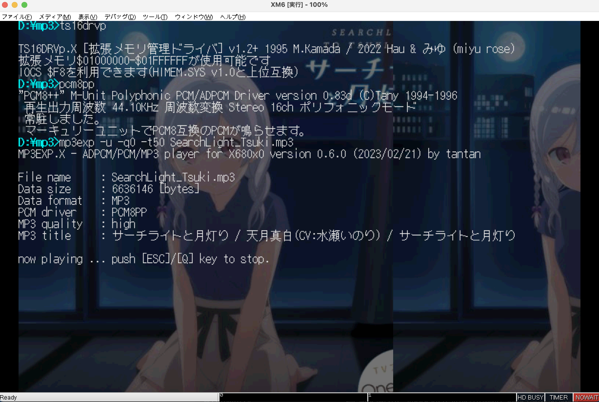

# MP3EXP.X
ADPCM/PCM/MP3 player for X680x0/Human68k

以下の形式のファイルを再生するプレーヤーです。ファイルの種別は拡張子で判断します。

 - X68K(MSM6258V) ADPCM 15.6kHz mono (.PCM)
 - 16bit符号付き big endian raw PCM (.S32/.S44/.S48/.M32/.M44/.M48)
 - MP3 (.MP3)

MP3のアルバムアート表示(JPEG/PNG)に対応しています。

出力デバイスは内蔵ADPCMまたはMercury-Unit(V3.5以上)になります。組み込むPCM8ドライバによって決まります。

- 出力先が内蔵ADPCMの時はすべての形式がリアルタイムに内蔵ADPCM(15.6kHz,mono)の音声に変換されます。
- 出力先がMercury-Unitの時はADPCM形式も含めたすべての形式の音声がMercury-Unitから出力されます。

注意：MP3ファイルの再生はかなりのMPUパワーを必要とします。事実上エミュレータ向けのオマケです。

注意：このプログラムはコンバータではありません。MP3形式ファイルを ADPCM/PCM 形式に変換するには

[MP3EX.X](https://github.com/tantanGH/mp3ex)

の方を使ってください。

注意：.S48/.M48をpcm8pp.xでMercury-Unitから正常に再生できません(すぐに終了してしまう)。現時点で原因不明につき非対応とさせてください。

---

### Install

MPEXPxxx.ZIP をダウンロードして展開し、MP3EXP.X をパスの通ったディレクトリに置きます。

デフォルトではADPCMのエンコードに philly さんの PCM8A.X を使用します(オリジナルのPCM8.Xではありません)。

[PCM8A.X](http://retropc.net/x68000/software/sound/adpcm/pcm8a/)

X68000 LIBRARY からダウンロードして導入してください。導入していない場合、またはオリジナルのPCM8.Xを使っている場合、内蔵ADPCMでの再生は可能ですが、PCM8A.X を導入した方がバッファリング時間などパフォーマンスが大きく改善します。

Mercury-Unit で再生する場合には たにぃ さんの PCM8PP.X を使用します。X68000 LIBRARY からダウンロードして導入してください。

[PCM8PP.X](http://retropc.net/x68000/software/hardware/mercury/pcm8pp/)

MP3再生時はデフォルトで周波数ハーフモードを使用するため Mercury-Unit V3.5 以上が必要です。オプション(`-q`)でフル周波数再生も可能です。その場合は V3.0/V3.1 でも大丈夫かもしれません。ただし 満開版 V4.0 での動作確認はしていません。(当方のエミュレータ環境だと V4.0 では pcm8pp.x が組み込めませんでした)

---

### 推奨環境

以下のエミュレータ環境を推奨します。

XM6 typeG
 - X68030 25MHz メモリ12MB MPU高速化許可 TS-6BE16拡張メモリ有効 ま〜きゅり〜ゆにっとV3.5
 - ハイメモリドライバ [TS16DRVp.X](https://t.co/qJDbBEiJsS) [https://twitter.com/arith_rose/status/1612786081308774402](https://twitter.com/arith_rose/status/1612786081308774402)
 - PCM8PP.X
 - MP3再生時にはMPUノーウェイト設定

実行例

    mp3exp -u -q1 -t50 hogehoge.mp3

ホスト機に余裕があるならば -q1 ではなく -q0 で

---

### データ形式ごとの要求MPU能力

* ADPCMファイルの再生

ディスク読み込みが遅くなければ X68000 10~16MHz機でも大丈夫かもしれません。ADPCMファイルは逐次ディスクから読み取ります。

* PCMファイルの再生

S44 (44.1kHz 16bit PCM stereo) の再生には最低 X68000 24MHz が必要です。実機ではX68030以上を推奨します。PCMファイルは逐次ディスクから読み取ります。

* MP3ファイル

XEiJエミュレータでの検証では X68000-600MHz, X68030-500MHz, 060turbo-50MHz が必要です。
XM6gエミュレータでの検証では MPUノーウェイト オプションを有効にすることで X68000/X68030 いずれも再生可能でした。
ただしMP3ファイルは最初に丸ごとメモリに読み込みます。12MBメモリフル実装設定かつハイメモリの利用を強くお勧めします。

---

### How to use

引数をつけずに実行するか、`-h` オプションをつけて実行するとヘルプメッセージが表示されます。

    usage: mp3exp [options] <input-file[.pcm|.s32|.s44|.s48|.m32|.m44|.m48|.mp3]>
    options:
         -a    ... do not use PCM8A.X for ADPCM encoding
         -b<n> ... buffer size [x 64KB] (2-32,default:4)
         -u    ... use 060turbo/ts-6be16 high memory for buffering
         -l[n] ... loop count (none:infinite, default:1)
         -q[n] ... mp3 quality (0:high, 1:normal, default:1)
         -t[n] ... mp3 album art brightness (1-100, 0:off, default:0)
         -h    ... show help message

`-a` PCM8A.X が常駐していない場合、または `-a` オプションをつけた場合は MP3EXP 自身で ADPCMエンコードを行います。精度は担保されますが、処理パフォーマンスが落ちます。できるだけ PCM8A.X / PCM8PP.X と組み合わせて使うようにしてください。

`-b` オプションでリンクアレイチェーンのバッファ数を指定します。1バッファが約64KBです。デフォルトは4です。再生が追いつかずにバッファアンダーランのエラーで途中終了してしまうような場合は大きくしてみてください。

`-u` オプションで可能な限り060turbo/TS-6BE16のハイメモリからアロケートします。060turbo.sys/HIMEM.SYS/TS16DRVp.Xなどのハイメモリドライバの事前導入が必要です。ただしDMACの転送が必要な部分についてはオプションの指定によらずメインメモリからアロケートします。MP3EXP.X は 060loadhigh によりプログラム部分のハイメモリ実行に対応していますが、060high でアロケート領域もハイメモリから取る実行はしないでください。

`-l` オプションでループ回数を指定します。数字を省略した場合は無限ループになります。

`-q` オプションでMP3再生時の品質を指定します。0でオリジナルのサンプリング周波数、1でオリジナルのサンプリング周波数の半分でデコードします。nを省略すると0を指定したものとみなします。デフォルト(オプションなし)は1です。

`-t` オプションでMP3アルバムアート表示の明るさを指定します。オプションなしまたは0の場合は表示しません。アルバムアートはjpeg/pngのみ対応しています。512x512pxを超える部分はカットされます。

---

### Shuffle play

ソースツリーの中にある `mp3shuffle.py` は [MicroPython for X680x0](https://github.com/yunkya2/micropython-x68k) 上で動作するシャッフル再生ツールです。カレントディレクトリにあるMP3ファイルをランダムに選択して再生します。コマンドライン引数で何ループするかを指定できます。

---

### License

MP3デコードライブラリとして libmad 0.15.1b をx68k向けにコンパイルしたものを利用させて頂いています。libmad は GPLv2 ライセンスです。

JPEGデコードライブラリとして Martin J. Fiedler氏の nanojpeg を改造したものを利用させて頂いています。nanojpeg は MIT ライセンスです。

PNGデコードのために zlib をx68k向けにコンパイルしたものを利用させて頂いています。zlibのライセンスはzlibライセンス(GPLに似ているがソースコード開示要求条項はない)です。

以上により MP3EXP のライセンスは libmad に準じた GPLv2 です。

---

### Special Thanks

* xdev68k thanks to ファミべのよっしんさん
* HAS060.X on run68mac thanks to YuNKさん / M.Kamadaさん / GOROmanさん
* HLK301.X on run68mac thanks to SALTさん / GOROmanさん
* XEiJ & 060turbo.sys thanks to M.Kamadaさん
* XM6 TypeG thanks to PI.さん / GIMONSさん
* PCM8A.X thanks to phillyさん
* PCM8PP.X thanks to たにぃさん
* TS16DRVp.X thanks to M.Kamadaさん / はぅさん / みゆ🌹ฅ^•ω•^ฅ さん
* MicroPython.X thanks to YuNKさん

---

### History

* 0.6.0 (2023/02/21) ... MP3アルバムアートワーク表示に対応, MP3曲名・アーティスト名・アルバム名表示に対応
* 0.5.4 (2023/02/20) ... MP3のバッファサイズを取りすぎていたのを修正
* 0.5.2 (2023/02/20) ... -qの仕様変更, TS-6BE16のハイメモリに対応
* 0.5.0 (2023/02/19) ... pcm8pp.x による Mercury-Unit での再生に対応
* 0.4.0 (2023/02/17) ... 初版